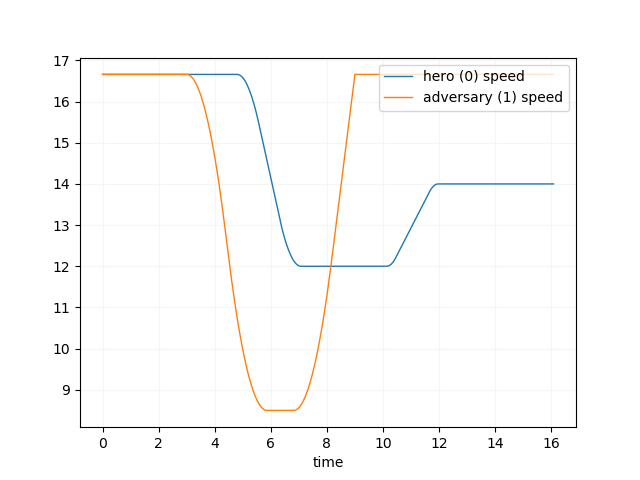

## Running scenarios
First of all, you need to get and build complete esmini from https://esmini.github.io.
Then clone this repository.
```
$ git clone https://gitlab.com/adas_monitoring/alks-simulation.git
```
In order to simulate a scenario and get the processed csv file as the result, run the following command in the main directory of esmini.
```
$ ./run.sh --osc path/to/scenario/file --timestep timestep --file file_name_without_format
```
You can also uncomment the following line in the bash file to get the speed vs time diagram.
```
$ python3 scripts/plot_dat.py "$file_name.dat'" --param speed
```
The result for a sample data would be as follow.

